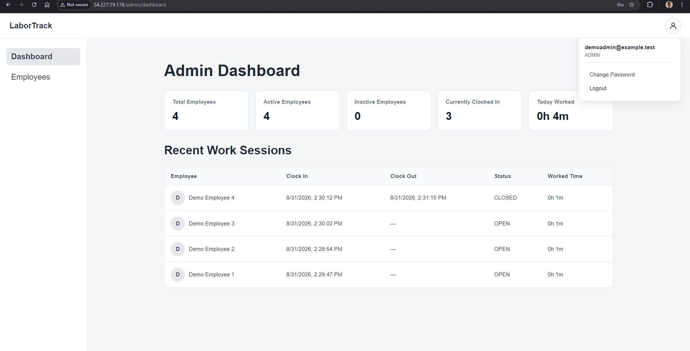
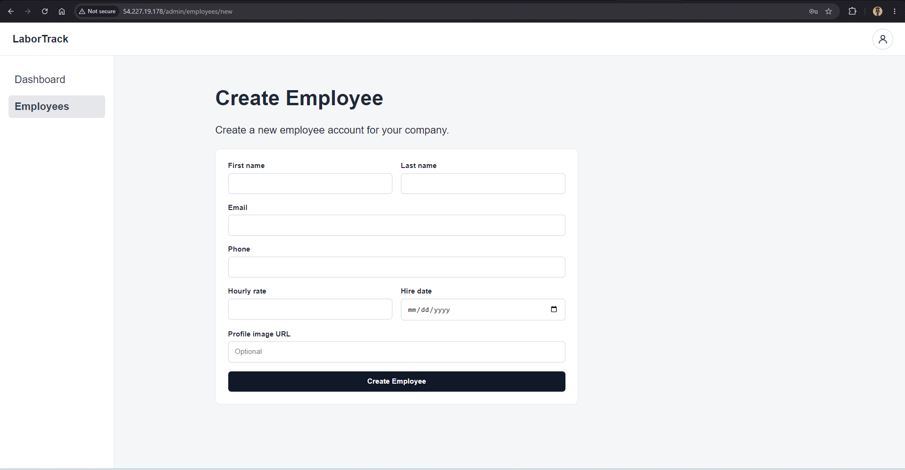
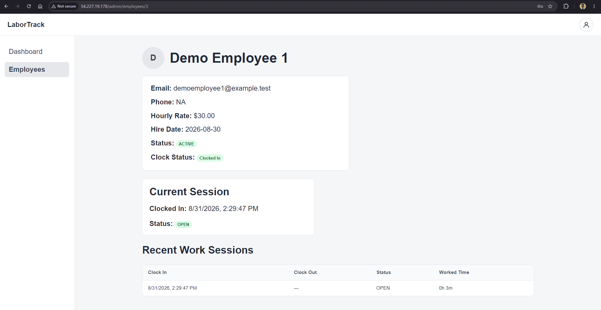
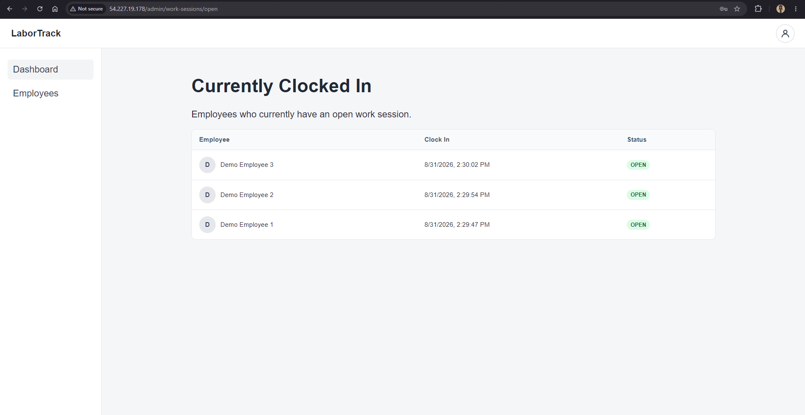
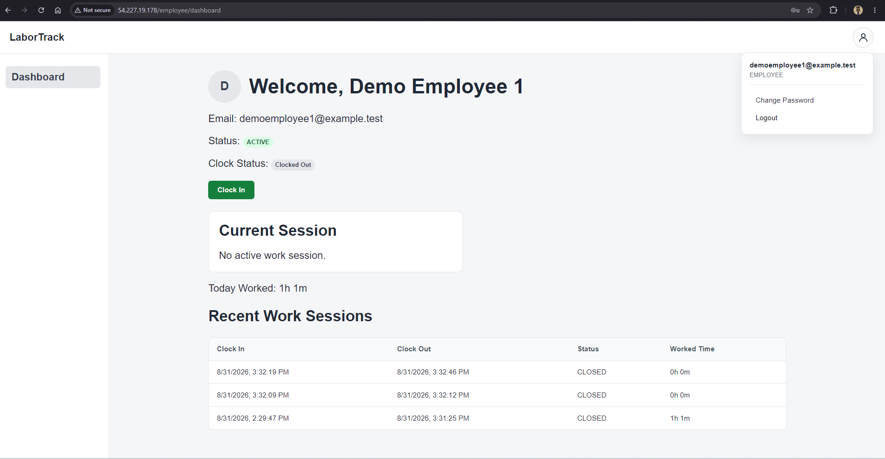
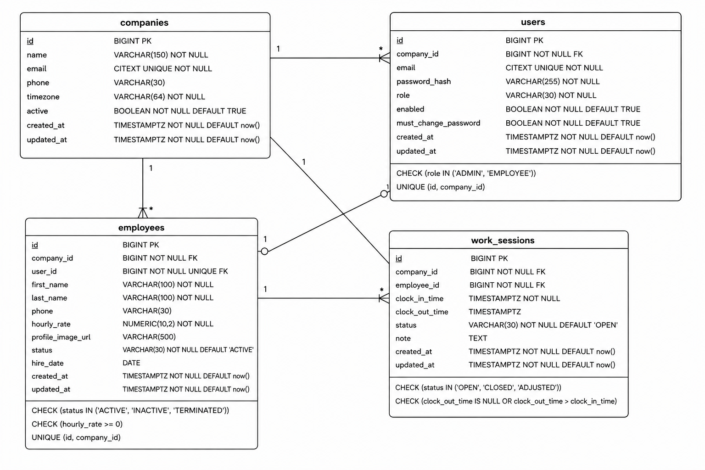

# LaborTrack

LaborTrack is a full-stack employee time-tracking application built for small businesses.<br>
It allows admins to manage employees and monitor workforce activity, while employees<br>
can clock in and out and review their own work sessions.

The application includes JWT authentication, role-based authorization, company-level<br>
data isolation, rate limiting, automated testing and CI, Dockerized deployment, and <br>
a live deployment on AWS.

**Tech:** Java 21 · Spring Boot · PostgreSQL · React · TypeScript · Docker · GitHub Actions · AWS

## Live Demo

**Application:** [Open LaborTrack](http://54.227.19.178/)

You can explore the application using either demo account:

### Admin Demo

- **Email:** `demoadmin@example.test`
- **Password:** `DemoAdmin123$`

### Employee Demo

- **Email:** `demoemployee1@example.test`
- **Password:** `DemoEmployee123$`

The admin account can create and manage employees, view workforce activity, and monitor<br>
current work sessions. Employees can clock in/out and review their own activity.

Demo data may change as other people use the application. You can also register a new<br>
company and go through the complete workflow yourself.

## Project Walkthrough

A typical LaborTrack workflow looks like this:

**Register company → Create employee → Employee changes temporary password → Clock in/out → Admin monitors activity**

### 90-Second Demo

A short walkthrough of LaborTrack covering the main admin and employee workflows:

**[Watch the LaborTrack Demo](https://youtu.be/Ukqaczwpn0s)**

## Screenshots

### Admin Dashboard



### Employee Management



### Employee Details



### Current Workforce Activity



### Employee Dashboard



## Why I Built LaborTrack

I first learned Java in college, where I built an early version of LaborTrack for a class.<br>
That project made me want to build something bigger that could be useful outside of school.

The idea came from thinking about small businesses I saw around NYC—bodegas, cafés,<br>
restaurants, clothing stores, and other family-owned businesses. My sister had also worked<br>
at a bodega when she was younger and told me they did not really have a system for tracking<br>
employee work time.

That made me interested in building a simple system where business owners could manage<br>
employees and track work activity, while employees could clock in and out and review their<br>
own work sessions.

My original college version used Java, Spark, PostgreSQL, HTML, CSS, and JavaScript.<br>
I was proud of it at the time, but as I learned more about backend development, I started<br>
seeing problems in my own design—especially around security, authorization, validation,<br>
testing, and how the application would actually be deployed.

After graduating, I decided to rebuild LaborTrack from the ground up using Spring Boot,<br>
React, and the production concepts I had been learning.

The goal was not just to make the old project look better. I wanted to understand how to<br>
build the same idea more carefully and make engineering decisions I could actually explain.

## Features

### Application Features

- Company registration with an admin account
- Employee account creation and management
- Admin and employee dashboards
- Employee clock in / clock out
- Employee work-session history
- Employee status filtering
- Paginated employee and work-session data
- Temporary employee credentials with required password change

### Engineering Features

- JWT-based authentication
- Role-based authorization for admins and employees
- Company-level data isolation
- BCrypt password hashing
- Rate limiting for sensitive endpoints
- PostgreSQL constraints for important business rules
- Flyway database migrations
- Automated backend tests
- GitHub Actions continuous integration
- Dockerized local and production environments

## Tech Stack

### Backend

- Java 21
- Spring Boot
- Spring Security
- Spring Data JPA
- PostgreSQL
- Flyway
- JWT
- Bucket4j
- Maven

### Frontend

- React
- TypeScript
- Vite
- React Router
- CSS

### DevOps / Deployment

- Docker
- Docker Compose
- Nginx
- GitHub Actions
- AWS EC2


## Architecture

LaborTrack uses a simple three-tier architecture:

```
Browser
   |
   v
Nginx + React
   |
   | /api
   v
Spring Boot
   |
   v
PostgreSQL
```

Nginx serves the React frontend and proxies `/api` requests to the Spring Boot backend.<br>
The backend handles authentication, business rules, and database access before communicating<br>
with PostgreSQL.

### Local Development

Docker Compose runs the frontend, backend, and PostgreSQL as separate containers on the<br>
same Docker network.

### AWS Deployment

The current deployment runs on a single AWS EC2 instance using Docker Compose.

```
Internet
   |
   v
AWS EC2
   |
   v
Nginx / React
   |
   v
Spring Boot
   |
   v
PostgreSQL
```

Only the Nginx/frontend entry point is exposed publicly. Spring Boot and PostgreSQL<br>
communicate through Docker's internal network and are not directly exposed to the internet.

## Database Design

LaborTrack uses PostgreSQL with Flyway migrations to keep schema changes versioned and<br>
reproducible.

The main relationships are:



Each company owns its users, employees, and work-session data. Employees are linked to<br>
user accounts for authentication, while work sessions belong to the employee who created them.

Important business rules are enforced both in the application and, where appropriate,<br>
at the database level. For example, a PostgreSQL partial unique index prevents an employee<br>
from having more than one open work session at the same time.

## Security

Security was one of the main areas I wanted to improve compared with the original version<br>
of LaborTrack.

Current security measures include:

- Passwords are hashed with BCrypt and are never stored in plain text.
- JWT tokens are used to authenticate users after login.
- Admin and employee endpoints are protected with role-based authorization.
- Company ownership is validated so users cannot access employees or work sessions<br>
  belonging to another company.
- Newly created employees receive temporary credentials and must change their password<br>
  before accessing the rest of the application.
- Login, registration, and password-change endpoints use stricter rate limits.
- Database credentials, JWT secrets, and other production configuration are provided<br>
  through environment variables instead of being hard-coded in the repository.
- The production backend and PostgreSQL database are not directly exposed to the public<br>
  internet. Requests enter through Nginx, which proxies API traffic to Spring Boot.

This is not a complete security setup, but I wanted the main protections in place from the<br>
beginning instead of adding them later.

## Engineering Decisions

### One Open Work Session

An employee should never have multiple active clock-ins at the same time. LaborTrack checks<br>
this rule in the application and also uses a PostgreSQL partial unique index as a second<br>
layer of protection at the database level.

### Timezone-Aware Dashboard

Daily workforce calculations use the company's configured timezone instead of assuming every<br>
company operates in the same timezone. This matters when calculating activity for "today"<br>
because the same timestamp can belong to a different calendar day depending on the company.

### Pagination Instead of Loading Everything

Employee lists and work-session history use pagination instead of returning every record at<br>
once. This keeps API responses smaller and gives the frontend a predictable way to navigate<br>
larger datasets.

### Simple Deployment First

I considered using more AWS services and a more complex architecture, but the current MVP<br>
does not need that complexity. I chose a single-EC2 deployment because it keeps the system<br>
easier to understand and maintain while keeping infrastructure costs low.

For now, I only want to add more infrastructure when LaborTrack actually needs it.

## Challenges & Lessons Learned

The hardest parts were designing authentication, company isolation, work-session rules,<br>
and deployment without making the system harder to understand than it needed to be.

Things I learned while building it:
- More complexity does not automatically make a system better. I originally considered<br>
  microservices, caching, more AWS services, and gateway-level rate limiting before the<br>
  application had a real need for them.
- Security is easier to design into a feature from the beginning than to add afterward.
- Important business rules should not rely only on application code when the database can<br>
  help enforce them too.
- Automated tests make it much safer to refactor code and catch edge cases.
- CI can expose problems that do not appear in a local development environment.
- Docker simplifies environment consistency, but it also requires understanding networking,<br>
  persistence, ports, and configuration.
- Production secrets and environment-specific configuration should stay outside source code<br>
  and container images.
- Cloud cost is an engineering constraint too. Infrastructure choices should match the actual<br>
  needs of the application.

The biggest change in how I approached this project was learning to ask "why does the system<br>
need this?" before adding another technology or layer of infrastructure.

## Testing & Continuous Integration

The backend currently includes 66 automated tests covering areas such as:

- Authentication and authorization
- Employee management
- Work-session behavior
- Dashboard endpoints
- Pagination
- Rate limiting

Backend tests can be run locally with:

```
./mvnw clean test
```

GitHub Actions also runs automatically on every push and pull request.

The CI pipeline:

- Starts a PostgreSQL test database
- Runs the Spring Boot test suite
- Installs frontend dependencies
- Builds the React frontend

## Deployment

LaborTrack is currently deployed on AWS using a single EC2 instance with Docker Compose.

The deployment runs the React/Nginx frontend, Spring Boot backend, and PostgreSQL database<br>
as separate containers.

I chose this setup because it keeps the infrastructure simple and the operating cost low<br>
while still giving me hands-on experience deploying on AWS.

The tradeoff is that the current deployment is not highly available. If the single EC2<br>
instance becomes unavailable, the application becomes unavailable as well.

## Running Locally

### With Docker

1. Clone the repository:

```
git clone https://github.com/Kratus15/labortrack.git
cd labortrack
```

2. Create the local environment files from the included examples and add the required <br>
database and JWT values.

3. Build and start the application:

```
docker compose up --build
```

Once the containers are running:

- Frontend: `http://localhost:3000`
- Backend: `http://localhost:8080`

To stop the application:

```
docker compose down
```

## Project Status

LaborTrack is an actively developed portfolio project. The current MVP is <br>
deployed and covers the main admin and employee workflows.

### What's Next

The next improvements I want to focus on are:

- Automated deployment (CD)
- HTTPS and a custom domain
- Admin work-session editing
- Employee and company profile editing
- Profile-picture support with AWS S3
- Application monitoring, logs, and uptime alerts

Larger infrastructure changes such as RDS or caching will be added only when the application<br>
has a real reason to need them.
